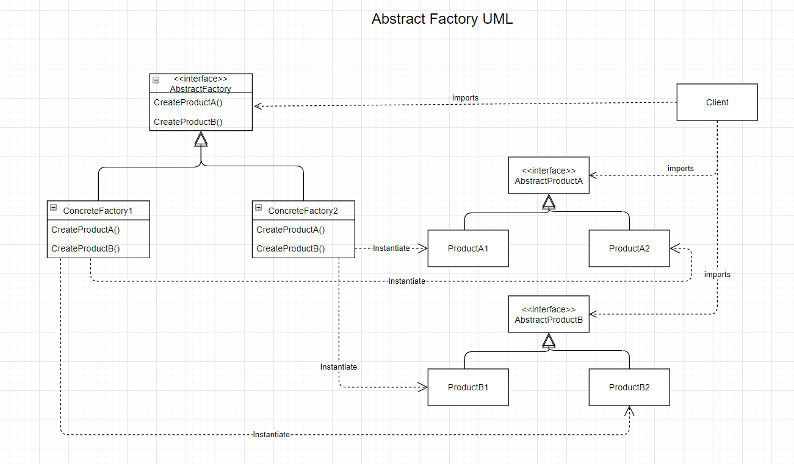

# The Abstract Factory Design Pattern (Creational Design Pattern)
- Kit

## Intent
- Provide an interface for creating families of related or dependant objects without specifying their concrete classes.Design Patterns

## The Problem
- Needing a way to create individual objects that match other objects of a similar family.
- Don't want to change existing code when adding a new products or families to the program.

## The Solution
- Have the client instantiate an abstract factory (interface) and have the client interact with the object through an abstract "product" interface. 

### The Participants
- AbstractFactory
    - Declares and interface for operations that create abstract product objects
- ConcreteFactory
    - Implements the operations to crate concrete product objects
- AbstractProduct
    - Declares an interface for a type of product object
- ConcreteProduct
    - Defines a product object to be crated by the corresponding concrete factory.
    - Implements the AbstractProduct interface
- Client
    - Uses only interfaces declared by AbstractFactory and AbstractProduct classes.

## Visuals

## Code (CSharp)

## Applicability
- Use when the code needs to work with various families of objects but don't want to depend of the concrete classes of those objects.
- Consider implementing this pattern when there is a class of Factory Methods.
- Each class should be responsible for one thing. When a class deals with multiple product types, it may be worth extracting its factory method into a stand-alone factory class or an Abstract Factory implementation.

## Pros and Cons
| Pros | Cons |
--- | ---
| Guaranteed objects from the factory are compatible with each other | The code base may become more complicated than it should be. |
| Avoids tight coupling between concrete object and client code | Higher levels of separation and abstraction can result in a system that is more difficult ot debug and maintain. |
| Single Responsibility Principle: Can Extract the object creation code into one place. |
| Open/Clost Principle: Can introduce new variants of products without breaking existing client code |

 

### Citations
- Erich Gamma, Richard Helm, Ralph Johnson, John Vlissides. *Design Patterns: Elements of Reusable Object-Oriented Software.*, Addison-Wesley, 1994.
- GeeksforGeeks. [Abstract Factory Design Pattern](https://https://www.geeksforgeeks.org/abstract-factory-pattern/). 
- Wikipedia. [Abstract Factory Method Pattern](https://en.wikipedia.org/wiki/Abstract_factory_pattern).
- Refactoring Guru. [Abstract Factory Method](https://https://refactoring.guru/design-patterns/abstract-factory).