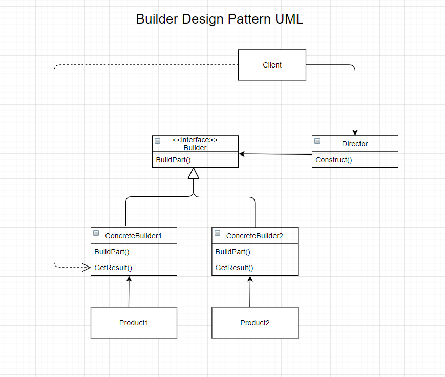

# The Builder Design Pattern (Creational Design Pattern)

## Intent
- Separate the construction of a complex object from its representation so that the same construction process can create different representation<sub>Design Patterns</sub>
- Allow for the construction of complex objects without forcing the client to build object step-by-step.

## The Problem
- When building a complex object we have 2 choices
    - Build a base class with a huge amount of subclass to to assemble the object
    - Have a class which a laundry list of properties that need to initialized by a constructor. 
- A client should not have to be responsible for the construction of a complex object. 

## The Solution
- Extract out the object construction code into it's own class.
- Make a Director class that will tell the builder how to make the class step-by-step.

## The Participants
- Builder (interface) 
    - specifies an abstract interface for creating parts of a 'Product' object. <sub>Design Patterns</sub>
- ConcreteBuilder
    - constructor and assembles parts of the product by implementing the Builder interface. <sub>Design Patterns</sub>
    - defines and keeps track of the representation it creates. <sub>Design Patterns</sub>
    - provides an interface for retrieving the product. <sub>Design Patterns</sub>
- Director
    - constructs an object using the Builder interface. <sub>Design Patterns</sub>
- Product
    - represents the complex object under construction. ConcreteBuilder builds the product's internal representation and defines the process by which it's assembled. <sub>Design Patterns</sub>
    - includes classes that define the constituent parts, including interfaces for assembling the parts into the final resuls. <sub>Design Patterns</sub>

## Visuals


## Code (CSharp)
``` CSharp
public class Car
{
    public string Make { get; set; }
    public string Make { get; set; }
    public int NumDoors { get; set; }
    public string Color {get; set; }

    public Car(string make, string model, string color, int numDoors)
    {
        Make = make;
        Model = model;
        Color = color;
        NumDoors = numDoors;
    }
}

public interface ICarBuilder
{
    string color { get; set; }
    int NumDoors { get; set; }

    Car GetResult();
}

public class FerrariBuilder : ICarBuilder
{
    public string Color { get; set; }
    public int NumDoors { get; set; }

    public Car GetResult()
    {
        return NumDoors == 2 ? new Car("Ferrari", "488 Spider", Color, NumDoors) : null;
    }
}

public class SportsCarBuildDirector
{
    private ICarBuilder _builder;

    public SportsCarBuildDirector(ICarBuilder builder)
    {
        _builder = builder;
    }

    public void Construct()
    {
        _builder.Color = "Red";
        _builder.NumDoors = 2;
    }
}

public class Client
{
    public void DoSomethingWithCars()
    {
        var builder = new FerrariBuilder();
        var director = new SportsCarBuildDirector(builder);

        director.Construct();
        Car myRaceCar = builder.GetResult();
    }
}
```
<sub>Wikipedia</sub>

## Applicability
- Use a builder to reduce the size of a large constructor.
- Use a builder when there is a need to create different representations of a product
- Use a builder to construct complex objects

## Pros and Cons
| Pros | Cons |
--- | ---
| Can construct objects step-by-step, defer construction steps or run steps recursively | Increase in complexity of the code due to the need to created multiple new classes.. |
| Can reuse the same construction code when building various representations of products. |
| Single Responsibility Principle: Can isolate complex construction code from the business logic of the product | 


<br />

### Citations
- Erich Gamma, Richard Helm, Ralph Johnson, John Vlissides. *Design Patterns: Elements of Reusable Object-Oriented Software.*, Addison-Wesley, 1994.
- Wikipedia. [Builder Pattern](https://en.wikipedia.org/wiki/Builder_pattern).
- Refactoring Guru. [Builder](https://refactoring.guru/design-patterns/builder).
- GeeksforGeeks. [Builder Design Pattern](https://www.geeksforgeeks.org/builder-design-pattern/)
