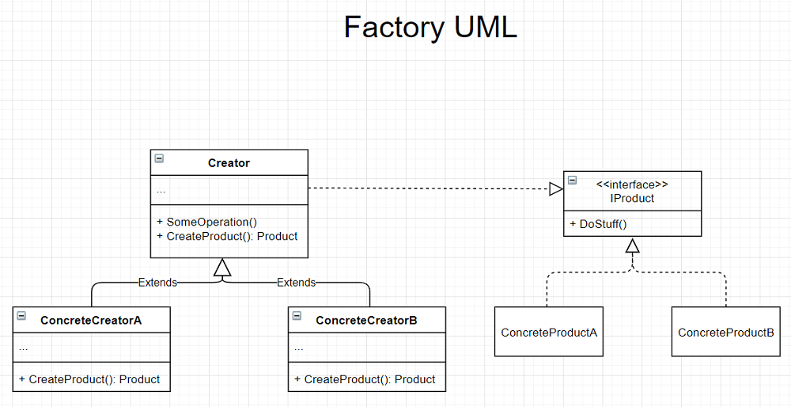

# The Factory Design Pattern (Creational Design Pattern)
- Also known as 'Virtual Constructor'

## Intent
- Define an interface for creating an object, but let subclasses decide which class to instantiate. <sub>Design Patterns</sub>
- Factory Method lets a class defer instantiation to subclasses. <sub>Design Patterns</sub>


## The Problem
- When the instantiation of a subclass is application specific, it's hard to predict which subclass is needed. 
- When an application knows when something needs to be created but doesn't know what type of object needs to be created. 

## The Solution
- Replace direct object constructor calls with calls to a `factory` method.
- The new method can be overridden by a subclass and change the product being created.
- Supports 'Open to extension/Closed to modification'

### The Participants
- Product
    - defines the interface of objects the factory method creates
- ConcreteProduct  
    - Implements the Product interface
- Creator
    - declares the factory method, which returns an object of type Product. Creator may also define a default implementation of the factory method that returns a default ConcreteProduct object.
    - may call the factory method to create a Product object
- ConcreteCreator   
    - overrides the factory method to return an instance of a Concrete Product

## Visuals


## CSharp Implementation


## Code (CSharp)
- Creator makes the factory method call
``` CSharp
public interface IPerson
{
  string GetName();
}

public class Villager : IPerson
{
  public string GetName()
  {
    return "Village Person";
  }
}

public class CityPerson : IPerson
{
  public string GetName()
  {
    return "City Person";    
  }
}

public enum PersonType
{
  Rural,
  Urban
}

public class Factory
{
  public IPerson GetPerson(PersonType type)
  {
    switch(type)
    {
      case PersonType.Rural:
        return new Villager();
      case PersonType.Urban:
        return new CityPerson();
      default:
        throw new NotSupportedException();
    }
  }
}
```
- A ConcreteCreator makes the factory method call
``` CSharp
public interface IProduct
{
    string GetName();
    string SetPrice(double price);    
}

public class Phone : IProduct
{
    private double _price;

    public string GetName()
    {
        return "Apple TouchPad";
    }

    public string SetPrice(double price)
    {
        _price = price;
        return "success";
    }
}

public abstract class ProductAbstractFactory
{
    protected abstract IProduct MakeProduct();

    public IProduct GetObject()
    {
        return this.MakeProduct();
    }
}

public class PhoneConcreteFactory : ProductAbstractFactory
{
    protected override IProduct MakeProduct()
    {
        IProduct product = new Phone();
        product.SetPrice(20.30);
        return product;
    }
}
```


## Applicability
- 'When you don't know beforehand the exact types and dependencies of the objects your code should work with.' <sub>Refactoring Guru</sub>
- When you want to provide clients a way to extend the internal components of your code.
- When you want to reuse existing objects instead of rebuilding them each time.
 

## Pros and Cons
| Pros | Cons |
--- | ---
| Avoid tight coupling between creator and concrete products | The code may become more complicated since there is an introduction of a lot of new subclasses.
| Single Responsibility Principle. The product created code gets moved into one place in the program, making it easier to support. |
| Open/Close Principle. New types of products can be introduced ino the program without breaking existing client code.


<br />

### Citations
- Erich Gamma, Richard Helm, Ralph Johnson, John Vlissides. *Design Patterns: Elements of Reusable Object-Oriented Software.*, Addison-Wesley, 1994.
- Wikipedia. [Factory Method Pattern](https://en.wikipedia.org/wiki/Factory_method_pattern).
- Refactoring Guru. [Factory Method](https://refactoring.guru/design-patterns/factory-method).