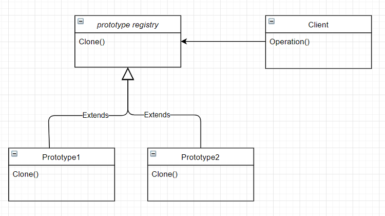

# The Prototype Design Pattern (Creational Design Pattern)
- Similar to Factory Design Pattern
    - Focused on Cloning

## Intent
"Specify the kinds of object to create using a prototypical instance, and create new objects by copying this prototype"<sub>Design Patterns</sub>
- Be able to copy an object without the code depending on their classes.

## The Problem
 Normally when you want to copy an object you have to instantiate it from a class, which is a costly process. Some of the properties and methods in that class maybe private so they can't be directly copied. Also it would require the copy to be dependant on that class. 

## The Solution
Let's move the job of make a clone to the object itself. Build out a method that allows the Object to be able to clone itself.

### The Participants
1. Prototype - This is the prototype of the actual object
1. Prototype Registry (Interface) - This is a service that has all the prototypes accessible using simple string parameters. (Shopping list of prototypes).
1. Client - The entity calling for the copy.

## Visuals


## CSharp Implementation
In C# all objects are clonable using `MemberwiseClone()`.

### Shallow Copy and Deep Copy
- Shallow - MemberwiseClone will copy all the properties and methods of the the prototype. 
    - This include references to objects the prototype is pointing at.
    - It will not make clones of the referenced objects
- Deep - This is the act of building new objects based off the prototypes properties.
    - Need to use the `new` keyword to build the new objects.

## Code (CSharp)
``` CSharp
public class Person : ICloneable
        {
            public int Age { get; set; }
            public DateTime BirthDate { get; set; }
            public string Name { get; set; }
            public IdInfo IdInfo { get; set; }

            public Person ShallowCopy()
            {
                return (Person)MemberwiseClone();
            }

            public object Clone()
            {
                return MemberwiseClone();
            }

            
            public Person DeepCopy()
            {
                Person clone = (Person)MemberwiseClone();
                clone.IdInfo = new IdInfo(IdInfo.IdNumber);
                clone.Name = Name;
                return clone;
            }
        }
```

## Applicability
- Use this pattern when code should not depend on concrete classes of objects that you need to copy.
    - Sometimes when you get an object from an interface you don't know how its implements which makes it hard to trust. Makeing copy reduces the reliance on that code. 

- This pattern can reduce the number of subclasses that only differ in the way they are initialized.
    - We can setup pre-built objects.

## Pros and Cons
| Pros | Cons |
--- | ---
 You can clone objects without coupling to their concrete classes. | Cloning complex objects that have circular references might be very tricky.
 You can get rid of repeated initialization code in favor of cloning pre-built prototypes. |
 You can produce complex objects more conveniently. |
 You get an alternative to inheritance when dealing with configuration presets for complex objects. |


<br />

### Citations
- Erich Gamma, Richard Helm, Ralph Johnson, John Vlissides. *Design Patterns: Elements of Reusable Object-Oriented Software.*, Addison-Wesley, 1994.
- GeeksforGeeks. [Prototype Design Pattern](https://www.geeksforgeeks.org/prototype-design-pattern/). 
- Wikipedia. [Prototype Pattern](https://en.wikipedia.org/wiki/Prototype_pattern).
- Refactoring Guru. [Prototype](https://refactoring.guru/design-patterns/prototype)