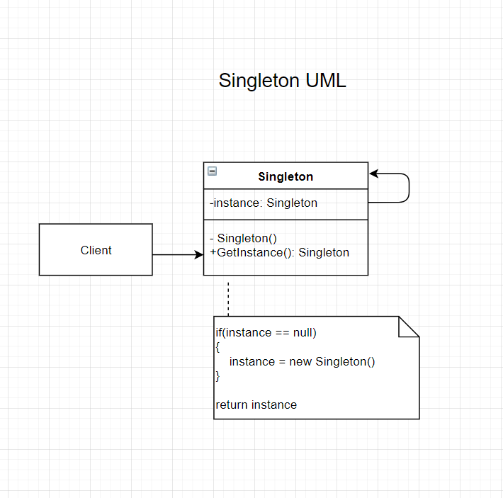

# The Singleton Design Pattern (Creatonal)

## Intent
- Ensure a class only has one instance, and provide a global point of access to it.<sub>Design Patterns</sub>

## The Problem
- Lets say you have a printer spool represented within your system. There can only be 1 spool so you have to guarantee that you can only implement the spool class only once.
- How do you provide access from the various objects in the system to that single instance of the spool

## The Solution
- Make that class into a singleton
    - Make the default constructor private. (no one outside of the class can use the `new` keyword to instantiate the class)
    - Create a static creation method that acts as a constructor. 

## The Participants
- Singleton
    - defines an Instance operation that lets clients access its unique instance.<sub>Design Patterns</sub>
    - may be responsible  for creating its own unique instance. <sub>Design Patterns</sub>

## Visuals


## Code (CSharp)
``` CSharp
public sealed class Singleton
{
    public static Singleton Instance { get; } = new Singleton();

    private Singleton();
}
```
<sub>Wikipedia</sub>

## Applicability
- When a class in the program should have only 1 instance availbit to all clients.
- If you *need* to have global variables 
    - provides stricter control over them.
    

## Pros and Cons
| Pros | Cons |
--- | ---
| Can be sure that a class has only a single instance | Violates the Single Responsibility Principle. (Solves 2 problems) |
| Gain a global access point to that instance | Can mask bad design (components know too much about each other) | 
| It's initialized only when requested for the first time. | Requires special treatment in multi-threaded applications. (Prevent a singleton to be created on each thread) |
| | Testing can become difficult do to the tightly coupled system. 

### Citations
- Erich Gamma, Richard Helm, Ralph Johnson, John Vlissides. *Design Patterns: Elements of Reusable Object-Oriented Software.*, Addison-Wesley, 1994.
- Wikipedia. [Singleton Pattern](https://en.wikipedia.org/wiki/Singleton_pattern).
- Refactoring Guru. [Singleton](https://refactoring.guru/design-patterns/singleton).
- GeeksforGeeks. [Singleton Design Pattern | Introduction](https://www.geeksforgeeks.org/singleton-design-pattern-introduction/?ref=lbp)