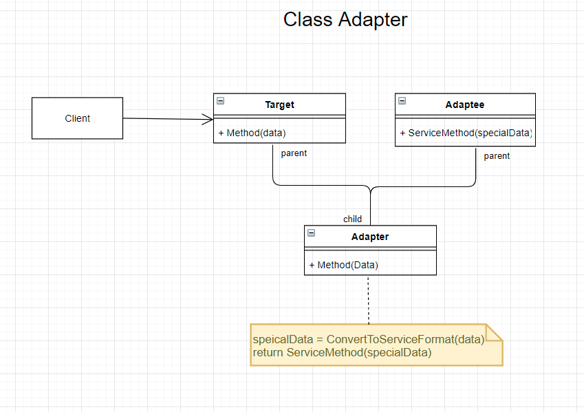
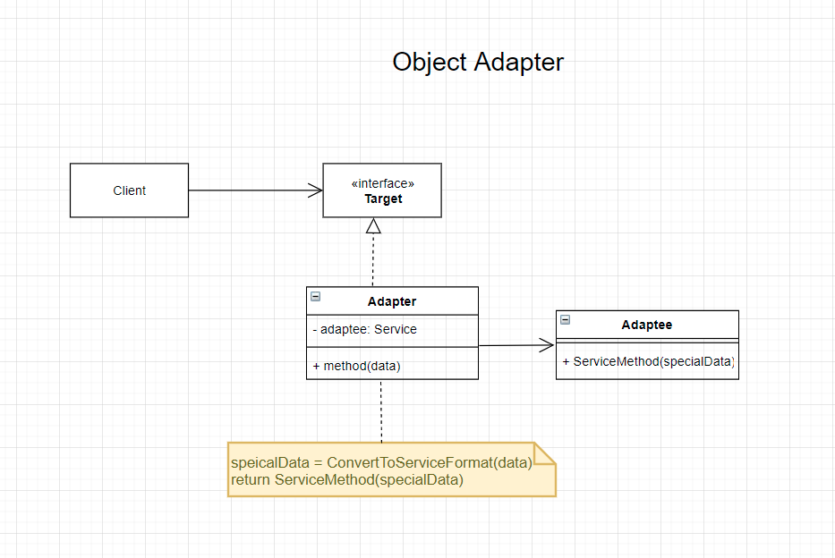

# The Adapter Design Pattern (Structural Design Pattern)
- Other Names
    - Wrapper

## Intent
- Convert the interface of a class into another interface that the client expects. Adapter lets classes work together that couldn't otherwise because of incompatible interfaces.

## The Problem
- Provide a way so that one system can interface with another system without having to change each others interface.

## The Solution
- An adapter is a special object that converts the interface of one object/system so that it can interact with another object/system that is expecting a different interface.

## The Participants
- Target
    - Defines the interface that the client uses
- Client
    - Works with the target object
- Adaptee (Service)
    - Defines the interface that needs to be adapted
- Adapter
    - Adapts the interface of the Adaptee with the interface of the target

## Forms of Adapters
- Class Adapter
    - Adapter inherits from both the Target and the Adaptee.
        - Only works with languages that supports multiple inheritance (C++, Python).
- Object Adapter
    - The adapter implements the target(client) interface and wraps the adaptee inside the adapter.
        - Usable with all modern programming languages.

## Visuals
- Class Adapter

- Object Adapter

## Code (CSharp)

## Applicability
- Use this when you want to use an existing class but the interface is incompatible with your code
    - Create a middle layer class that serves as a translator between classes.

- Use when you want to reuse existing subclasses that lack common interfaces.
    
## Implementation Steps
1. Define which class is the client and which one is the adaptee
1. Declare the client interface.
1. Create the adapter class that implements the client's defined interface.
1. Add a field (private variable) that stores a reference to the adpatee class. 
    - usually initialized in the adapter constructor
1. Implement the clients interface methods inside the adapter.
    - Where possible make the adpatee do all the work and the adapter only has to handle the conversion.
1. Client is only allowed to use the adapter.   
    - The client should not have any knowledge of the adaptee.

## Pros and Cons
| Pros | Cons |
--- | ---
| Single Responsibility Principle. You can separate the interface or data conversion code from the primary business logic of the program. | Complexity of the code increases. (New interfaces and classes to deal with)|
| Open/Close Principle. You can introduce new types of adapters into the system without breaking the existing client code.

 

### Citations
- Erich Gamma, Richard Helm, Ralph Johnson, John Vlissides. *Design Patterns: Elements of Reusable Object-Oriented Software.*, Addison-Wesley, 1994.
- GeeksforGeeks. [Adapter Pattern](https://www.geeksforgeeks.org/adapter-pattern/). 
- Wikipedia. [Adapter pattern](https://en.wikipedia.org/wiki/Adapter_pattern).
- Refactoring Guru. [Adapter](https://refactoring.guru/design-patterns/adapter).